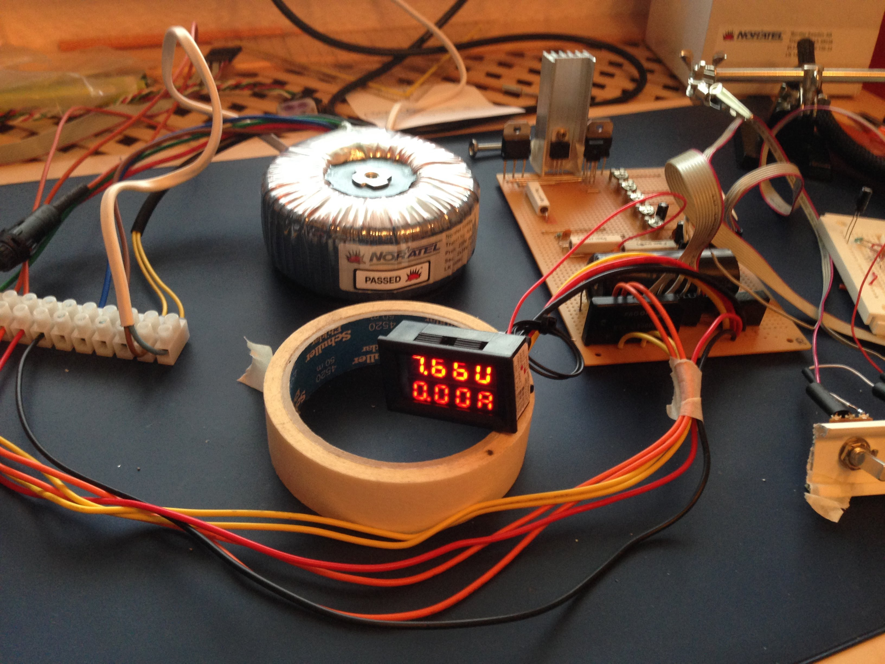
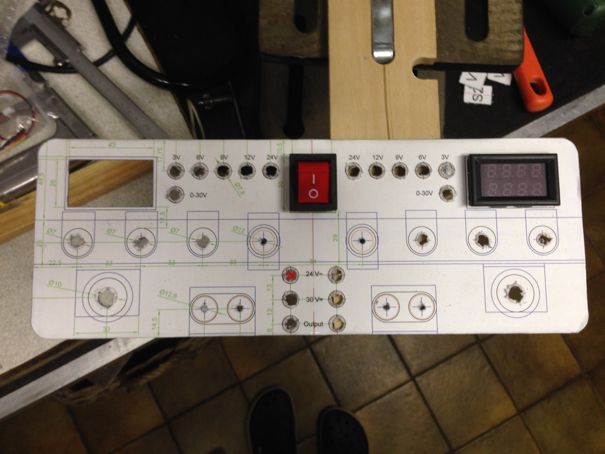
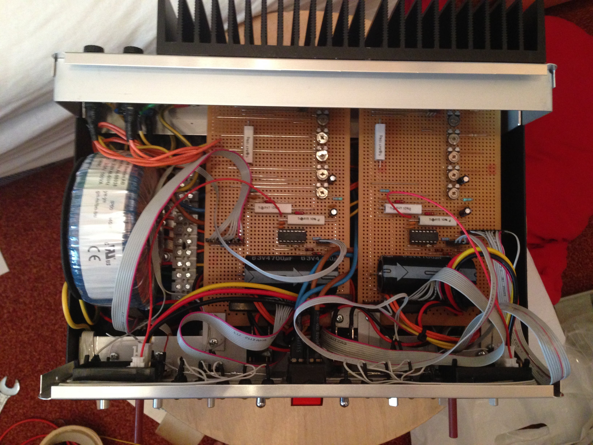
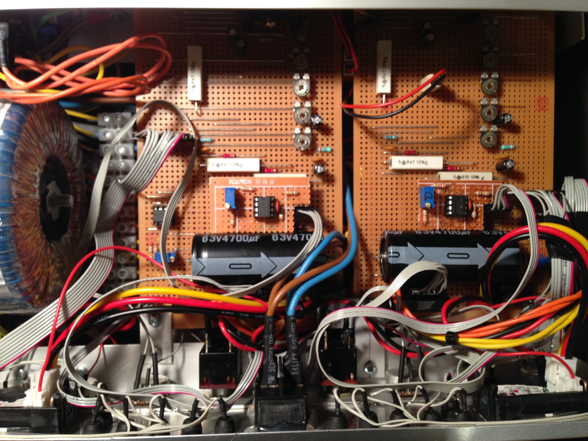
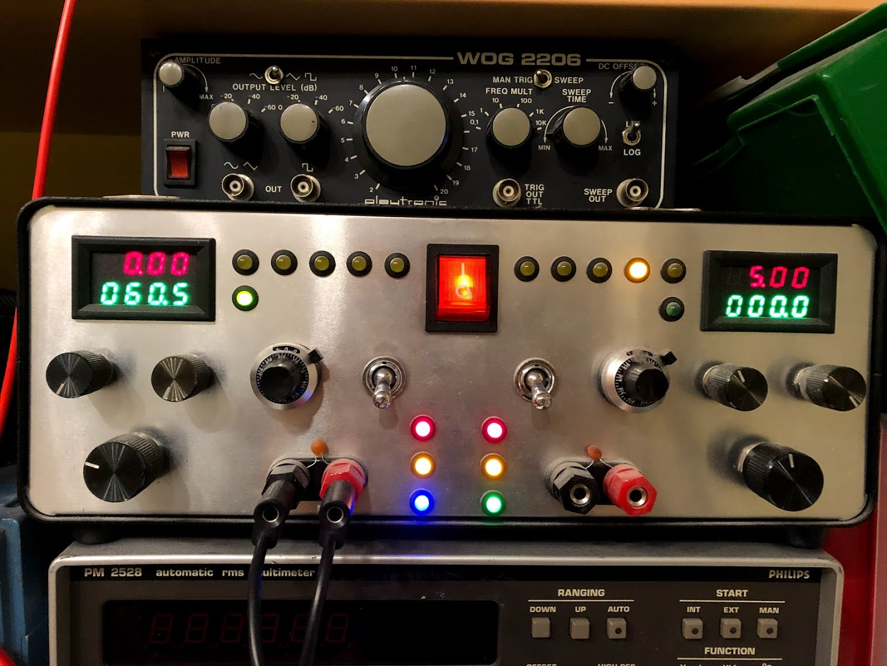

# Stabilized Power Supply with current limiting

Not recommended for new designs, very old analog ICs.

My first electronics project. Development started with very little knowledge of electronics. Basic functionality, was upgraded several times for better performance. Still working without any defects.

basic setup

frontpanel

finished assembly

pcb patch: analog PI regulator for better constant current handling.

final looks